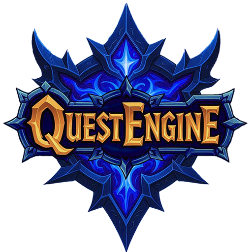
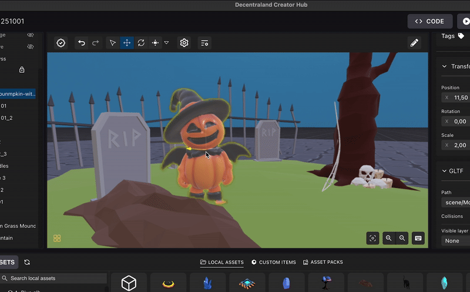
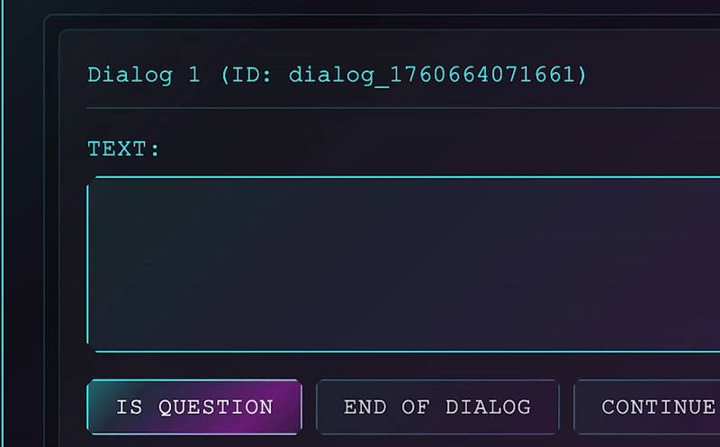
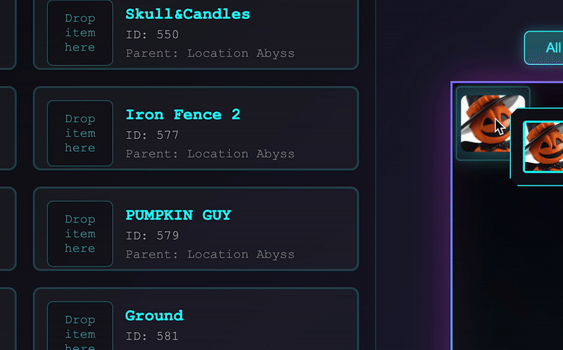

# QuestEngine - Quest Editor for Decentraland



[](https://github.com/CansyLand/QuestEngine/releases/latest)
[](https://github.com/CansyLand/QuestEngine/blob/main/LICENSE)
[](https://github.com/CansyLand/QuestEngine/issues)

QuestEngine is a desktop application built with Electron that integrates with the [Decentraland Creator Hub](https://decentraland.org/create/) to help game creators build quests and stories using a drag-and-drop interface. It runs alongside the Creator Hub, importing scene changes and enabling creators to design interactive quests for Decentraland worlds.

## Features

- **Drag-and-Drop Quest Creation**: Build quests and stories with an intuitive UI.
- **Seamless Decentraland Integration**: Syncs with Creator Hub scenes to link entities.
- **Dialog and Objective Editor**: Write dialogues and define quest objectives easily.
- **Cross-Platform**: Available as a macOS DMG for Apple Silicon (ARM64).

## Installation

### Via App (macOS)

1. Download the latest [QuestEngine.dmg](https://github.com/CansyLand/QuestEngine/releases/latest/download/QuestEngine.dmg) from [Releases](https://github.com/CansyLand/QuestEngine/releases/latest).
2. Open the DMG and drag `QuestEngine.app` to your Applications folder.
3. Launch `QuestEngine.app` and select the folder containing your Decentraland scene (created with Creator Hub).

### Building from Source

1. Clone the repository:
   ```bash
   git clone https://github.com/CansyLand/QuestEngine.git
   cd QuestEngine
   ```
2. Install dependencies:
   ```bash
   npm install
   ```
3. Build the app:
   ```bash
   npm run build
   ```
4. Package for macOS:
   ```bash
   npm run package
   ```
5. Run the app:
   ```bash
   npm start
   ```
   Select your Decentraland scene folder when prompted.

## Usage

QuestEngine simplifies quest creation for Decentraland scenes. Follow these steps to create and play quests:

1. **Drag Entities into Creator Hub**  
   Add NPCs or other entities to your Decentraland scene.  
   

2. **Write Dialogs and Define Quest Objectives**  
   Use the QuestEngine UI to create dialogues and set objectives (e.g., collect items).  
   

3. **Link Entities**  
   Connect Creator Hub entities to QuestEngine entities via drag-and-drop.  
   

4. **Play Your Quest**  
   Test your quest in the QuestEngine player or Decentraland.  
   

5. **Integrate with Decentraland Scene**  
   To enable QuestEngine functionality in your Decentraland project, add the following code to your `src/ui.tsx` and `src/index.ts` files:

   **Update `src/ui.tsx`**:

   ```tsx
   import ReactEcs, { ReactEcsRenderer, UiEntity } from '@dcl/sdk/react-ecs'
   import * as npc from './questEngine/npcToolkit/index'

   export function setupUi() {
   	ReactEcsRenderer.setUiRenderer(uiComponent)
   }

   const uiComponent = () => (
   	<UiEntity
   		uiTransform={{
   			width: '100%',
   			height: '100%',
   		}}
   	>
   		<npc.NpcUtilsUi />
   	</UiEntity>
   )
   ```

   **Update `src/index.ts`**:

   ```ts
   import { setupUi } from './ui'
   import { createQuestEngine } from './questEngine'
   import { AudioSystem } from './questEngine/AudioSystem'

   // Global portrait override map
   const npcPortraitOverrides: Map<string, string> = new Map()

   // Function to set NPC portrait override
   export function setNpcPortrait(npcId: string, portraitPath: string) {
   	npcPortraitOverrides.set(npcId, portraitPath)
   }

   // Function to get NPC portrait (with override support)
   export function getNpcPortrait(
   	npcId: string,
   	defaultPortrait: string
   ): string {
   	return npcPortraitOverrides.get(npcId) || defaultPortrait
   }

   // Export the portrait override map so LocationAdapter can access it
   export { npcPortraitOverrides }

   export async function main() {
   	setupUi()

   	// Set custom portrait NPC
   	setNpcPortrait('pumpking_guy', 'assets/images/pumpkin-portrait.png')

   	// Initialize the quest engine
   	const audioSystem = new AudioSystem()
   	const questEngine = await createQuestEngine(audioSystem, undefined, true) // debug mode enabled

   	// Start the game
   	const commands = questEngine.start()
   	questEngine.executeCommands(commands)

   	// Load Location
   	const emptyLocationCommands = questEngine.changeToLocation('cementery') // Es defined in QuestEditor App
   	questEngine.executeCommands(emptyLocationCommands)

   	// Activate Quest
   	const activateQuestCommands =
   		questEngine.activateQuest('pumpkin_guys_quest')
   	questEngine.executeCommands(activateQuestCommands)
   }
   ```

## QuestEngine Concepts

- **Location**: Defines visible entities (Items, NPCs, Portals) when a player is in a specific area.
- **Item**: Objects in the game, such as keys, crystals, or trees.
- **Portal**: Unloads the current location and loads another.
- **Quest**: Contains a series of Quest Steps.
- **Quest Step**: Specifies objectives (e.g., collect 10 crystals). Can spawn/despawn items.
- **Dialog Sequence**: A list of Dialogs for NPC interactions.
- **Dialog**: A single text section in an NPC’s UI, optionally with question buttons.

## Roadmap

- Integrate as an npm package (e.g., using `dcl-npc-toolkit`) instead of copying files to Decentraland’s `src`.
- Enhance UI/UX for a smoother experience.
- Add a node-based editor for visual quest flow creation.
- Implement an AI agent to generate and modify quest flows.
- Enable auto-updates via `electron-updater`.

## Contributing

We welcome contributions! Please see our [Contributing Guide](docs/CONTRIBUTING.md) for details. Report issues or suggest features on the [Issues](https://github.com/CansyLand/QuestEngine/issues) page.

## License

This project is licensed under the [MIT License](LICENSE).
